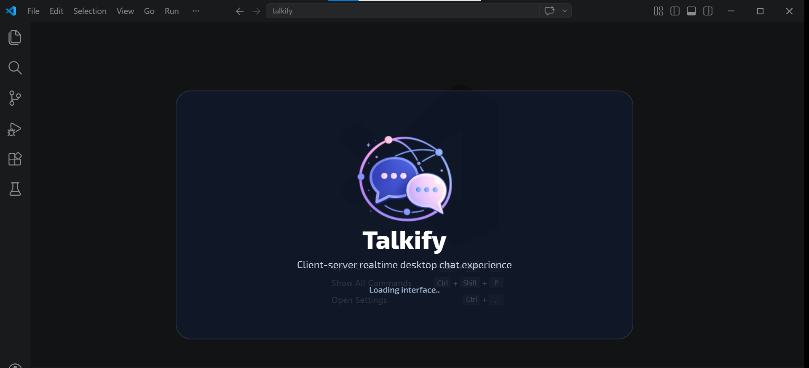
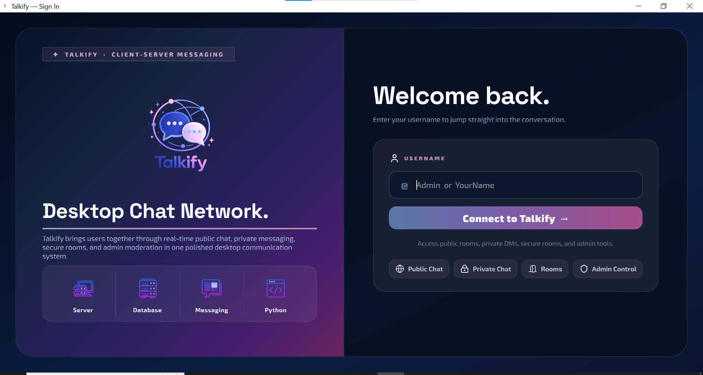
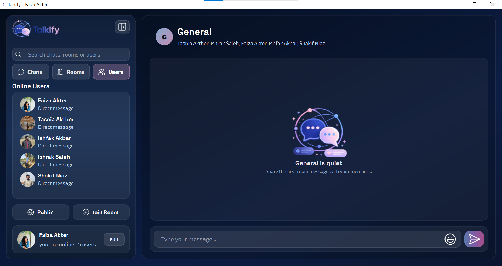
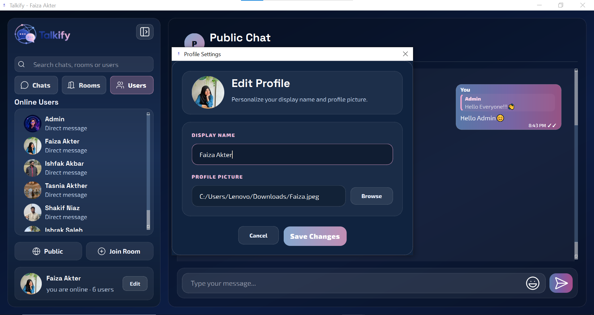
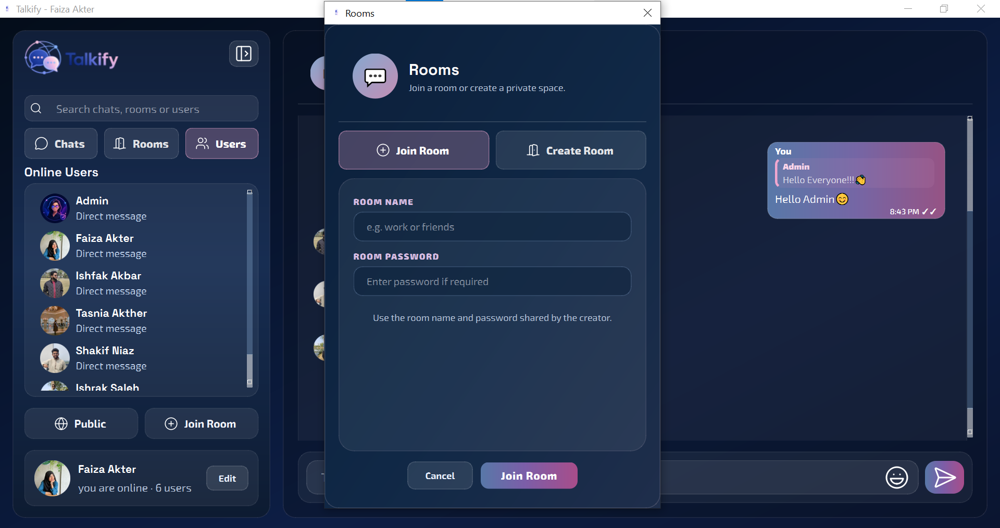
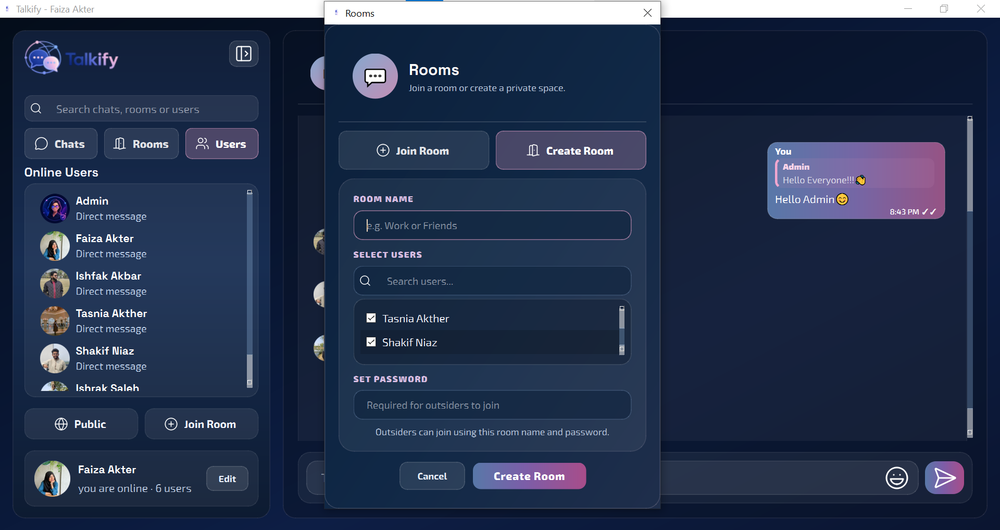
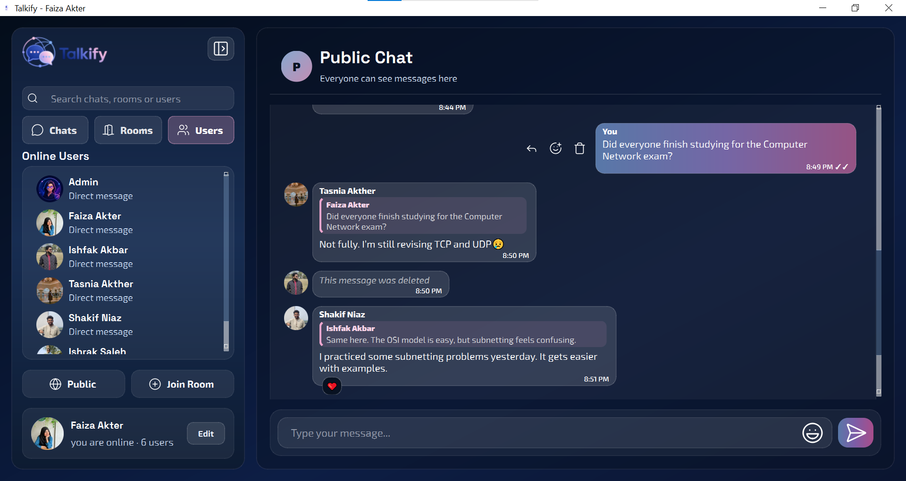
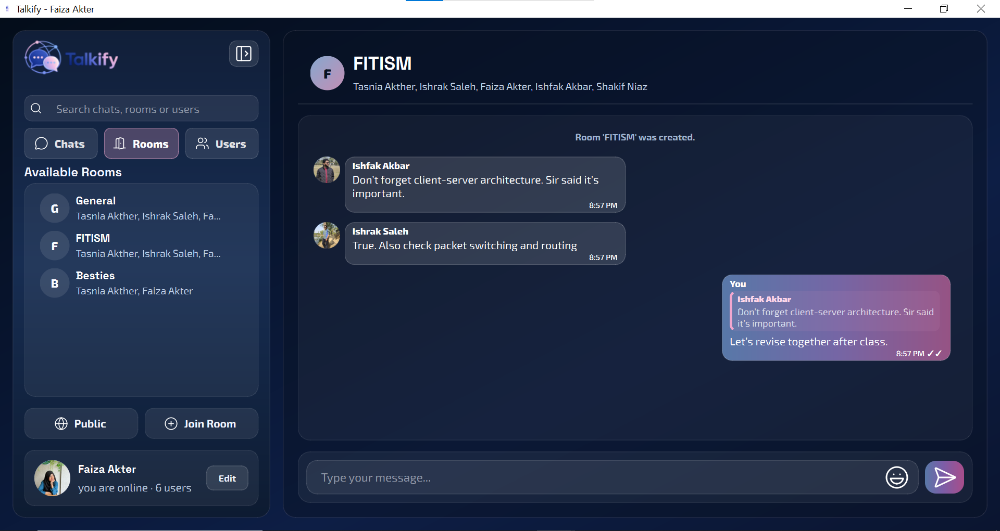
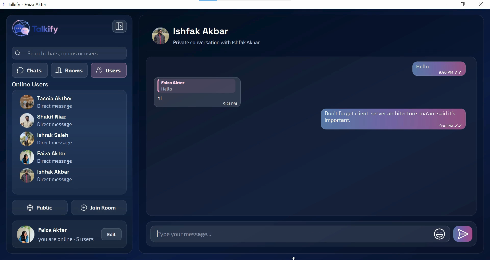
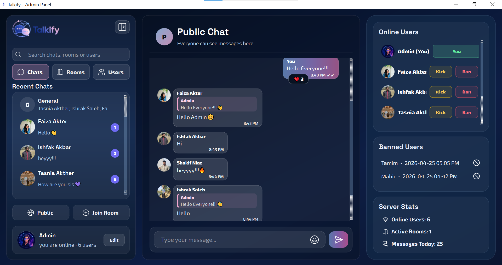

#  Talkify

**Real-Time Multi-Client Desktop Chat Application using Python TCP Sockets and PySide6**

Talkify is a modern **Python-based desktop chat application** designed for real-time communication in a secure and interactive client-server environment. It combines TCP socket programming, 
threaded server management, JSON packet exchange, XAMPP MySQL integration, admin moderation, room-based messaging, profile customization, emoji reactions, message replies, typing indicators, 
and a polished PySide6 interface to deliver a complete desktop chatting experience.

---

##  Features Overview

### Chat Features
- ✅ Real-time multi-client chat using TCP sockets  
- ✅ Username-based login system  
- ✅ Duplicate username prevention  
- ✅ Public chat support  
- ✅ Private one-to-one messaging  
- ✅ Room-based group messaging  
- ✅ Create custom chat rooms  
- ✅ Join rooms using room name and password   
- ✅ Online user list synchronization  
- ✅ Join and leave notifications  
- ✅ JSON-based packet communication  
- ✅ Threaded server handling for multiple clients  

---

### User Features
- ✅ Clean splash screen before login and Modern login window   
- ✅ Editable display name and Profile picture selection  
- ✅ Rounded avatar preview   
- ✅ Online user status indicator  
- ✅ Search/filter users while creating rooms  
---

###  Message Features
- ✅ Public messages  
- ✅ Private messages  
- ✅ Room messages  
- ✅ Sent/delivered status display  
- ✅ Reply-to-message support  
- ✅ Reply preview inside message bubbles  
- ✅ Delete own messages  
- ✅ Emoji picker 
- ✅ Emoji reaction picker for messages   
- ✅ Hover actions for reply, react, and delete  
- ✅ Message bubble avatars
- ✅ Typing Indicator

---

###  Admin Features
- ✅ Admin-only kick control  
- ✅ Admin-only ban control  
- ✅ Admin check through MySQL database   
- ✅ Save banned users in database  
- ✅ Prevent banned users from logging in again  
- ✅ Admin response messages   
- ✅ Live admin statistics  
- ✅ Online users count  
- ✅ Active rooms count  
- ✅ Messages today count  
- ✅ Banned users list with time  

---

###  UI / UX Features
- ✅ Professional dark glassmorphism theme  
- ✅ Navy, pastel blue, and dusty pink color palette   
- ✅ Custom splash screen styling  
- ✅ login screen styling  
- ✅ Sidebar branding panel  
- ✅ Modern chat header  
- ✅ Empty chat state design   
- ✅ Custom message bubbles  
- ✅ Custom sidebar items  
- ✅ Custom chat list items  
- ✅ Custom room dialog  
- ✅ Custom profile dialog  
- ✅ Custom emoji picker  
- ✅ Custom reaction picker  
- ✅ Admin panel styling  
- ✅ Icon-based message actions  
- ✅ Smooth rounded avatar rendering  

---

## Tech Stack

| Layer | Technology |
|------|-----------|
| Programming Language | Python |
| GUI Framework | PySide6 |
| Networking | Python socket |
| Concurrency | threading |
| Data Format | JSON |
| Database | MySQL |
| Database Server | XAMPP MySQL |
| Database Connector | PyMySQL |
| Styling | QSS |
| Architecture | Client-Server |
| UI Pattern | Desktop Messenger Interface |

---

## 📂 Project Structure

```txt
TALKIFY/
├── .venv/
├── client/
│   ├── __pycache__/
│   ├── controllers/
│   │   ├── __pycache__/
│   │   ├── __init__.py
│   │   ├── chat_controller.py
│   │   └── login_controller.py
│   ├── ui/
│   │   ├── __pycache__/
│   │   ├── assets/
│   │   │   ├── avatars/
│   │   │   ├── icons/
│   │   │   ├── styles/
│   │   │   │   └── theme.qss
│   │   │   ├── default_avatar.png
│   │   │   ├── logo.png
│   │   │   └── logo1.png
│   │   ├── widgets/
│   │   │   ├── __pycache__/
│   │   │   ├── __init__.py
│   │   │   ├── chat_list_item.py
│   │   │   ├── emoji_picker.py
│   │   │   ├── info_card.py
│   │   │   ├── message_bubble.py
│   │   │   ├── profile_dialog.py
│   │   │   ├── room_dialog.py
│   │   │   ├── room_list_item.py
│   │   │   ├── sidebar_item.py
│   │   │   ├── typing_indicator.py
│   │   │   └── user_list_item.py
│   │   ├── __init__.py
│   │   ├── admin_window.py
│   │   ├── chat_window.py
│   │   ├── login_window.py
│   │   └── splash_screen.py
│   ├── __init__.py
│   ├── client_main.py
│   └── network_client.py
├── database/
│   ├── sample_data.sql
│   └── schema.sql
├── server/
│   ├── __pycache__/
│   ├── __init__.py
│   ├── admin_manager.py
│   ├── client_handler.py
│   ├── database.py
│   ├── message_store.py
│   ├── room_manager.py
│   └── server_main.py
├── shared/
│   ├── __pycache__/
│   ├── __init__.py
│   ├── config.py
│   ├── protocol.py
│   └── utils.py
├── tests/
├── venv/
├── .gitignore
└── main_client.py
```

---

## User & Admin System
| User Type | Access |
|------|-----------|
| Normal User | Login, public chat, private chat, room chat, profile update, emoji reactions |
| GUI Framework | All user features plus kick, ban, admin statistics, and banned-user monitoring, A user with username admin is treated as an admin |

---

### Application Flow
- Start the Talkify server
- Launch the client application
- Splash screen appears
- Login window opens
- User enters a username
- Client connects to the server
- Server checks if the username is empty, duplicate, or banned
- Server creates the user in the database if needed
- Client receives login success
- Main chat window opens
- User list and room list are synchronized
- User can chat publicly, privately, or inside rooms
- User can reply, react, delete messages, and update profile
- Admin can kick or ban users
- Server sends live updates to all connected clients
- 
---

## Screenshots

| Splash Screen                                        | Onboarding Screen                                       | User Window                                            |
| -----------------------------------------------------| ---------------------------------------------------| -------------------------------------------------------|
|  |  |  |

| Profile Setting                                          | Join Room                                      | Create Room                                      |
| ---------------------------------------------------------| -----------------------------------------------| -------------------------------------------------|
|  |    |  |

| Public Chat                                      | Room Chat                                        |  Private Chat                                      |
|--------------------------------------------------|--------------------------------------------------| ---------------------------------------------------|
|  |    |   |

| Admin Window                                     | 
|--------------------------------------------------|
|  | 


---


## 📦 Installation Guide

### 1️⃣ Clone Repository
```bash
git clone https://github.com/your-username/talkify.git
cd talkify
```
### 2️⃣ Create Virtual Environment
```bash
python -m venv .venv
```
### 3️⃣ Activate Virtual Environment
```bash
.venv\Scripts\activate
```
### 4️⃣ Install Dependencies
```bash
pip install PySide6 PyMySQL
```
### 5️⃣ Start XAMPP MySQL 

MySQL

### 6️⃣ Create Database
Create a database named:<br>
chat_app_db

### 7️⃣ Import Database Files
Import these files from the database/ folder using phpMyAdmin:<br>
schema.sql<br>
sample_data.sql

### 8️⃣ Start Server
```bash
python -c "from server.server_main import ChatServer; ChatServer().start()"
```
### 9️⃣ Start Client
```bash
python main_client.py
```

---
## 👩‍💻 Developer

Faiza Akter Borsha<br>
ID: 232-134-022<br>
Batch 5th<br>
Project – Talkify
---
